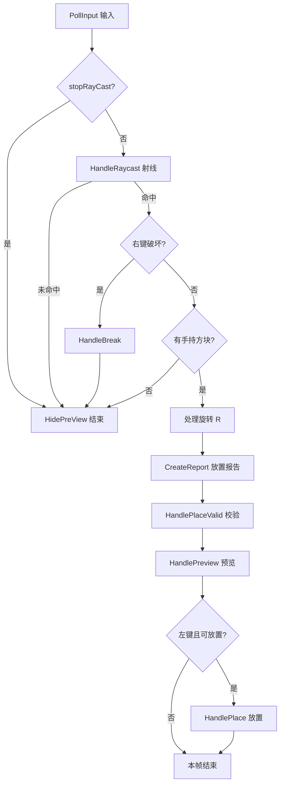

# Mm Builder · 体素建造系统

基于 Unity 的**体素 / 方块建造**方案，玩法类似《我的世界》《生存战争》等：网格占格、瞄准放置、旋转多格方块、区域限制建造。

工程由两大部分组成，可独立理解、组合使用：

| 模块 | 职责 |
|------|------|
| **A. 建造系统** | 射线、预览、校验、放置 / 破坏、虚拟网格分区、存档 |
| **B. 方块系统** | 单方块预制体上的生命周期与玩法扩展 |

---

## Quick Start

### 1. 打开示例场景

`Assets/_Scripts/Mm_Builder/Scene/MmScene.unity`

### 2. 场景必备组件

- `BuilderVirtualGrid` — 格大小、`gridGroups` 建造分区  
- `BuilderSystem` — 绑定 `BuilderSystemSetting`，`Update` 内已调用 `UpdateBuilderSystem()`  
- 主相机、带 Collider 的地面 / 方块 Layer 与 Setting 中配置一致  

### 3. 运行时选手持方块

```csharp
// UI 热键或背包选中时
BuilderSystem.Instance.SetActiveCubeData(woodCubeData);
```

### 4. 挂接外部规则（背包示例）

```csharp
using Mm_Budier;
using UnityEngine;

public class InventoryBuildBridge : MonoBehaviour, IBuilderCustom
{
    [SerializeField] Inventory inventory;

    void Start()
    {
        BuilderSystem.Instance.SetImBuilder(this);
    }

    public bool CustomRaycastValid(out RaycastHit hit)
    {
        hit = default;
        return true;
    }

    public bool CustomPlaceValid(out BuilderPlacementReport placement, CubeData cubeData)
    {
        return inventory.Has(cubeData.CubeType, 1);
    }

    public bool CustomBreakValid(out Vector3Int gridPos, CubeData cubeData)
    {
        return true;
    }

    public void CustorOnPlaceSucceeded(CubeInstance cubeInstance)
    {
        inventory.Consume(cubeInstance.data.CubeType, 1);
    }

    public void CustorOnBreakSucceeded(CubeInstance cubeInstance)
    {
        inventory.Add(cubeInstance.data.CubeType, 1);
    }
}
```

### 5. 自定义输入（不用默认鼠标时）

```csharp
// 自有输入系统里 在 UpdateBuilderSystem 之前或代替 PollInput
BuilderSystem.Instance.SetPlaceButtonPressed();
BuilderSystem.Instance.SetBreakButtonPressed();
BuilderSystem.Instance.SetRotateButtonPressed();

// 打开背包 UI 时
builderSystem.SetStopRayCast(true);
```

### 6. 编辑器首次配置

1. **Tools → MmBuilderSsytem → BuildEditorWindow**  
2. 「枚举管理器」生成 `ECubeType` 与 `CubeData`  
3. 「分区管理」划定可建造区域并应用到场景  
4. 「建造系统设置」检查射线 Layer、预览材质  

---

## A. 建造系统（Builder System）

### 核心能力

- **放置 / 破坏 / 旋转**（Y 轴 0° / 90° 两档）
- **放置预览**（可放置 / 不可放置材质区分）
- **虚拟网格 & 建造分区**（`BuilderVirtualGrid` + `gridGroups`，可配置允许建造范围）
- **多格方块**（按占格尺寸与旋转写入运行时字典）
- **存档 / 读档**（方块 origin + 类型 + 旋转）
- **编辑器工具**（见下方「编辑器窗口」）

### 运行时主循环

`BuilderSystem.UpdateBuilderSystem()` 每帧编排流程如下：



与代码顺序一致：

1. **输入更新** — `PollInput`（默认：左键放置、右键破坏、R 旋转）；也可用 `SetXxxButtonPressed` 注入自定义输入  
2. **射线更新** — `HandleRaycast`，过滤玩家与 `IBuilderCustom.CustomRaycastValid`  
3. **处理破坏** — 右键时 `HandleBreak`（命中格 → 校验 → 拆除）  
4. **处理旋转** — 切换 `placementRotation`  
5. **处理放置** — 生成 `BuilderPlacementReport` → 校验 → 预览 → 左键落子  

### 外部开发者扩展（无侵入）

实现 `IBuilderCustom`，通过 `BuilderSystem.SetImBuilder(...)` 挂接。**无需修改建造系统源码**。

| 回调 | 时机 | 典型用途 |
|------|------|----------|
| `CustomRaycastValid` | 射线命中候选过滤 | 忽略特定 Layer / 物体 |
| `CustomPlaceValid` | 放置**前** | 背包是否足够、权限、任务区域（预览红绿） |
| `CustomBreakValid` | 破坏**前** | 保护建筑、权限、任务方块 |
| `CustorOnPlaceSucceeded` | 放置**成功后** | 扣材料、成就、联网同步 |
| `CustorOnBreakSucceeded` | 破坏**成功后** | 退还材料、统计 |

自定义输入：不覆盖 `PollInput` 亦可，在自有 UI / 输入系统中调用：

- `SetActiveCubeData(CubeData)` — 选手持方块  
- `SetPlaceButtonPressed()` / `SetBreakButtonPressed()` / `SetRotateButtonPressed()`  
- `SetStopRayCast(true)` — UI 打开时屏蔽建造  

### 关键类型

| 类型 | 说明 |
|------|------|
| `BuilderSystem` | 场景单例，建造编排入口 |
| `BuilderVirtualGrid` | 格单位大小、分区列表、Gizmo |
| `BuilderPlacementReport` | 一次「意图放置」：起点格、尺寸、旋转 |
| `CubeInstance` | 运行时实例（配置、GameObject、origin、旋转） |
| `BuilderSystemSetting` | 射线 Layer、预览材质、存档路径等 |

### 场景组件

1. 空物体挂 `BuilderVirtualGrid` + `BuilderSystem`  
2. 指定 `BuilderSystemSetting` 与 `activeCubeData`（或运行时 `SetActiveCubeData`）  
3. 配置 `gridGroups` 或使用编辑器「分区管理」写入场景 / JSON  

---

## B. 方块系统（Cube System）

### 核心能力

- **清晰生命周期**（预制体上的 `CubeBehaviour`）  
- **编辑器枚举 / CubeData 管线**（与建造系统共用 `ECubeType`、`CubeData`）  
- **已接入建造系统**（放置 / 破坏时自动调用生命周期）

### 生命周期

| 方法 | 调用时机 | 说明 |
|------|----------|------|
| `OnPlaced` | 实例化并写入字典之后 | 初始化方块自身逻辑 |
| `OnRemoved` | 从场景销毁之前 | 清理、特效 |
| `OnUpdated` | 预留 | 数据变更（如升级） |
| `OnInteract` | 预留 | 玩家交互 |

继承示例：`TestCube : CubeBehaviour`。

**与 `IBuilderCustom` 的分工：**

- `IBuilderCustom` — 全局规则（背包、权限、射线）  
- `CubeBehaviour` — **该预制体专属**逻辑（门、炮塔、箱子 UI）  

---

## 编辑器窗口

菜单：**Tools → MmBuilderSsytem → BuildEditorWindow**

| 页签 | 功能 |
|------|------|
| **枚举管理器** | 维护 `ECubeType`、生成枚举代码与 `CubeData` 资产 |
| **建造系统设置** | 运行时 `BuilderSystemSetting` |
| **分区管理** | 编辑 `grid-groups.json`、与场景 `BuilderVirtualGrid` 同步 |

枚举输出路径支持粘贴后 **回车** 自动解析（可粘贴 `.cs` 文件路径自动拆目录与文件名）。

---

## 目录结构（简要）

```
Assets/_Scripts/Mm_Builder/
├── README.md
├── Scene/                          # 示例场景
├── Scripts/
│   ├── BuilderSystem/              # A. 建造系统
│   │   └── Scripts/
│   │       ├── Core/               # BuilderSystem、虚拟网格、接口
│   │       ├── Runtime/            # Report、CubeInstance、IBuilderCustom
│   │       ├── Data/               # CubeData、配置 SO
│   │       └── Editor/             # BuildEditorWindow、枚举生成、分区
│   └── CubeSystem/                 # B. 方块行为基类与示例
├── Prefab/
└── ...
```

---

## 默认操作（PollInput）

| 操作 | 输入 |
|------|------|
| 放置 | 鼠标左键 |
| 破坏 | 鼠标右键 |
| 旋转 | R |

---

## 依赖说明

- **Odin Inspector**（编辑器与部分 SO 展示）
- **Unity Input System**（默认输入轮询）
- **Newtonsoft.Json**（存档与分区配置）

---

## 后续可扩展方向

- RTS / 第三人称射线模式（`ERayType`）  
- `BuilderInputReport` 统一输入报告  
- 破坏 / 放置失败时的显式回调（当前通过 `CustomXxxValid` 返回 `false` 表达失败）  

---

> 设计原则：**建造系统只管「格子上能不能放、怎么放」**；**玩法与经济交给 `IBuilderCustom` 与 `CubeBehaviour`**。
